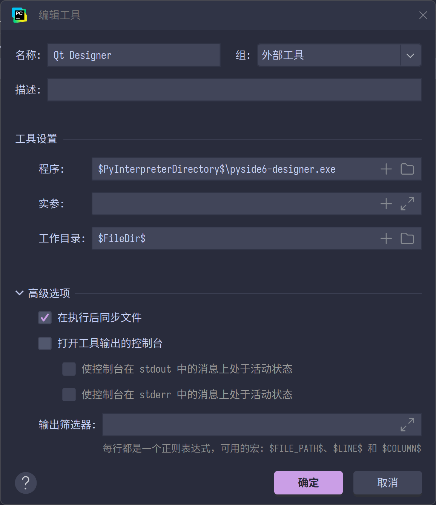
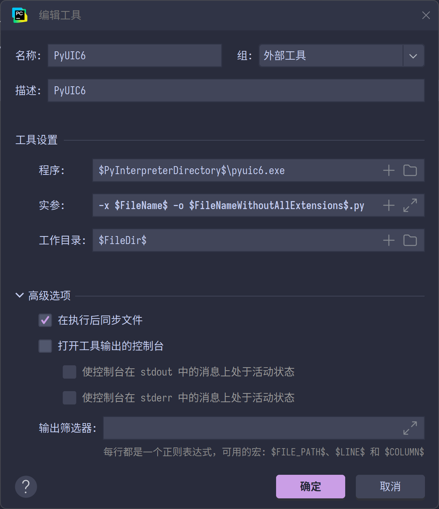

# PyQt6 GUI 开发示例

## 1. 项目概述

本项目是一个使用PyQt6库开发的GUI应用程序示例，包含多个窗口和界面。每个示例文件展示了如何使用PyQt6创建不同类型的窗口和界面组件。

## 2. 版本相关
Python版本：`3.12.6`   
包管理器：[`uv`](https://juejin.cn/post/7444548883646709796)  
依赖包：  
1. black==25.1.0
2. pyqt6==6.8.1
3. pyside6>=6.8.2.1

### uv官方资源
- [GitHub仓库](https://github.com/astral-sh/uv)  
- [中文教程](https://vra.github.io/2024/03/31/uv-tutorial1/)

## PyCharm 外部工具
### Qt Designer - 图形化QT设计软件
- 名称：`Qt Designer`
- 程序：`$PyInterpreterDirectory$\pyside6-designer.exe`
- 工作目录：`$FileDir$`

### PyUIC6 - 将ui文件转换为py文件
- 名称：`PyUIC6`
- 程序：`$PyInterpreterDirectory$\pyuic6.exe`
- 实参：`-x $FileName$ -o $FileNameWithoutAllExtensions$.py`
- 工作目录：`$FileDir$`

